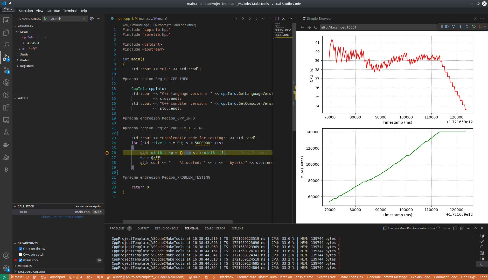

### CppProjectTemplate_VSCodeCMakeTools
Universal template of C++ project, was made to rapid start the new C++ project, easy debug and profile it. 
Configured over [MS C/C++ Extension Pack](https://marketplace.visualstudio.com/items?itemName=ms-vscode.cpptools-extension-pack) extension.

### Main tasks
* `CMake: Clean` - run `cmake.clean` command + remove all Valgrind reports
* `CMake: Configure and Build` - configure and run `cmake.build` command
* `CMake: Configure and Rebuild` - configure and run `cmake.cleanRebuild` command
* `CMake: Configure with Conan Install` - install `conanfile.txt` and run `cmake.configure` command
* `LiveProcMon: Start Monitoring` - start real-time monitoring of the target process (by default taken from `cmake.launchTargetPath`)
* `LiveProcMon: Stop Monitoring` - stop monitoring
* `Valgrind: Show Memcheck Report` - show profiler's report (check for memory leaks)
* `Valgrind: Show Cachegrind Report` - show profiler's report (check for chache missings)
* `Valgrind: Show Callgrind Report` - show profiler's report (check for tree of calls and theirs performing times)

### Features
* uses `CMake` to manage the project, configured to use extension [ms-vscode.cmake-tools](https://marketplace.visualstudio.com/items?itemName=ms-vscode.cmake-tools)
* uses Conan, automatically downloads packages from `conanfile.txt` before building the project
* easy to make and show `Valgrind` reports
* `LiveProcMon` feature checks resources consumption of the launched application, easy to configure, strart and stop:

* easy access to cppreference (via hotkey `Ctrl+Shift+A`) to get description of specified data type, method, etc
* enabled auto linting (with `clang-tidy`)
* enabled auto formatting (with `clang-format`)
* automatically [applies](https://github.com/R3D9477/CppProjectTemplate_VSCodeCMakeTools/blob/main/CMakeLists.txt#L6) name of directory as name of a project/library
* automatically [finds and adds](https://github.com/R3D9477/CppProjectTemplate_VSCodeCMakeTools/blob/main/CMakeLists.txt#L9) needed sources and includes into the project's tree **(non-recursive globbing)**; easy and flexible configuration process of source tree for current target: just [add](https://github.com/R3D9477/CppProjectTemplate_VSCodeCMakeTools/blob/main/CMakeLists.txt#L11) needed folder [to list](https://github.com/R3D9477/CppProjectTemplate_VSCodeCMakeTools/blob/main/CMakeLists.txt#L11)
* automatically adds some of libraries (if possible): [Boost](https://github.com/R3D9477/CppProjectTemplate_VSCodeCMakeTools/blob/main/CMakeLists.txt#L175), [Qt5](https://github.com/R3D9477/CppProjectTemplate_VSCodeCMakeTools/blob/main/CMakeLists.txt#L122), [Qt6](https://github.com/R3D9477/CppProjectTemplate_VSCodeCMakeTools/blob/main/CMakeLists.txt#L122)
* [applies](https://github.com/R3D9477/CppProjectTemplate_VSCodeCMakeTools/blob/main/CMakeLists.txt#L136) some compiler's extra flags because of safety. each compiler has a different set of flags: [GCC](https://github.com/R3D9477/CppProjectTemplate_VSCodeCMakeTools/blob/main/CMakeLists.txt_z_SafetyFlags_GNU.cmake#L1), [Clang](https://github.com/R3D9477/CppProjectTemplate_VSCodeCMakeTools/blob/main/CMakeLists.txt_z_SafetyFlags_CLANG.cmake#L1) or [MSVC](https://github.com/R3D9477/CppProjectTemplate_VSCodeCMakeTools/blob/main/CMakeLists.txt_z_SafetyFlags_MSVC.cmake#L1)
* automatically [finds and adds Boost unit tests](https://github.com/R3D9477/CppProjectTemplate_VSCodeCMakeTools/blob/main/CMakeLists.txt#L192) *(**don't use** the dot symbol '.' in the name of test's source file!)*
* for MSVC automatically [copies](https://github.com/R3D9477/CppProjectTemplate_VSCodeCMakeTools/blob/main/CMakeLists.txt#L152) MS Visual C++ runtime libs to target building directory

### Basic project's stucture
ㅤㅤㅤㅤ**[ PROJECT_FOLDER = PROJECT_NAME ]**
 ㅤㅤㅤㅤㅤㅤㅤㅤ|
 ㅤㅤㅤㅤㅤㅤㅤㅤ|- *[CMakeLists.txt](CMakeLists.txt)*
 ㅤㅤㅤㅤㅤㅤㅤㅤ|- test
 ㅤㅤㅤㅤㅤㅤㅤㅤ|- lib
 ㅤㅤㅤㅤㅤㅤㅤㅤㅤㅤㅤㅤ|- **[ somelib ]**
 ㅤㅤㅤㅤㅤㅤㅤㅤㅤㅤㅤㅤㅤㅤㅤㅤ|
 ㅤㅤㅤㅤㅤㅤㅤㅤㅤㅤㅤㅤㅤㅤㅤㅤ|- *[CMakeLists.txt](lib/somelib/CMakeLists.txt)*
 ㅤㅤㅤㅤㅤㅤㅤㅤㅤㅤㅤㅤㅤㅤㅤㅤ|- include
 ㅤㅤㅤㅤㅤㅤㅤㅤㅤㅤㅤㅤㅤㅤㅤㅤ|- src
 ㅤㅤㅤㅤㅤㅤㅤㅤㅤㅤㅤㅤㅤㅤㅤㅤ|- test
 ㅤㅤㅤㅤㅤㅤㅤㅤㅤㅤㅤㅤㅤㅤㅤㅤ|- thirdparty
 ㅤㅤㅤㅤㅤㅤㅤㅤㅤㅤㅤㅤㅤㅤㅤㅤㅤㅤㅤㅤ|
 ㅤㅤㅤㅤㅤㅤㅤㅤㅤㅤㅤㅤㅤㅤㅤㅤㅤㅤㅤㅤ|- **[ thirdlib ]**
 ㅤㅤㅤㅤㅤㅤㅤㅤㅤㅤㅤㅤㅤㅤㅤㅤㅤㅤㅤㅤㅤㅤㅤㅤ|
 ㅤㅤㅤㅤㅤㅤㅤㅤㅤㅤㅤㅤㅤㅤㅤㅤㅤㅤㅤㅤㅤㅤㅤㅤ|- *[CMakeLists.txt](lib/somelib/thirdparty/thirdlib/CMakeLists.txt)*
 ㅤㅤㅤㅤㅤㅤㅤㅤㅤㅤㅤㅤㅤㅤㅤㅤㅤㅤㅤㅤㅤㅤㅤㅤ|- include
 ㅤㅤㅤㅤㅤㅤㅤㅤㅤㅤㅤㅤㅤㅤㅤㅤㅤㅤㅤㅤㅤㅤㅤㅤ|- src
 ㅤㅤㅤㅤㅤㅤㅤㅤㅤㅤㅤㅤㅤㅤㅤㅤㅤㅤㅤㅤㅤㅤㅤㅤ|- test

### Install needed stuff first
* install gcc (e.g. `apt install gcc gdb`)
* install clang (e.g. `apt install clang clang-tidy clang-format lldb`)
* install python (e.g. `apt install python3 python3-venv`, do `python3 -m venv ~/.local --system-site-packages` and add `~/.local/bin` to global `PATH` variable)
* install cmake (e.g. `pip install cmake`)
* install conan (e.g. `pip install conan` and do `conan profile detect`)
* install ploting tools (e.g. `pip install gprof2dot matplotlib pillow`)

### How to use
1. clone that repositoy to your local machine
2. add some external libraries in [CMakeLists.txt_a_Libs.cmake](https://github.com/R3D9477/CppProjectTemplate_VSCodeCMakeTools/blob/main/CMakeLists.txt_a_Libs.cmake)
3. add source of uint tests to folder `test` or add/change you testing configuration in [CMakeLists.txt_b_Tests.cmake](https://github.com/R3D9477/CppProjectTemplate_VSCodeCMakeTools/blob/main/CMakeLists.txt_b_Tests.cmake)
4. change required libraries in [conanfile.txt](https://github.com/R3D9477/CppProjectTemplate_VSCodeCMakeTools/blob/main/conanfile.txt), the package manager will handle it automatically during first build
5. if needed, you can customize safety flags for your current compiler: [GCC](https://github.com/R3D9477/CppProjectTemplate_VSCodeCMakeTools/blob/main/CMakeLists.txt_z_SafetyFlags_GNU.cmake#L1), [Clang](https://github.com/R3D9477/CppProjectTemplate_VSCodeCMakeTools/blob/main/CMakeLists.txt_z_SafetyFlags_CLANG.cmake#L1) or [MSVC](https://github.com/R3D9477/CppProjectTemplate_VSCodeCMakeTools/blob/main/CMakeLists.txt_z_SafetyFlags_MSVC.cmake#L1)
6. if neeeded, add [HERE](https://github.com/R3D9477/CppProjectTemplate_VSCodeCMakeTools/blob/main/CMakeLists.txt#L11) specific sources and includes of your current project (example you can see [HERE](https://github.com/R3D9477/SimpleCustomQmlItemQt6Cmake/blob/master/CMakeLists.txt#L12))
7. for the first time it will be proposed to choose sertain development kit via standard menu of CMake Tools (the same as `>CMake: Select a Kit`)
8. press `F5` to build `Debug` version (variant selected by default in CMake Tools) and run debugging process (by default using LLDB, can be changed in `launch.json`)
9. use tasks 
* `LiveProcMon: Start Monitoring` to check resources consumption at real-time
* `Valgrind: Show Memcheck Report`, `Valgrind: Show Callgrind Report` and `Valgrind: Show Cachegrind Report` to get profiler's reports

### Extra variables
you can use some of variables in your own configuration:
* **variable** `SAFETY_FLAGS` - contains the list of the compiler's flags ([GCC](https://github.com/R3D9477/CppProjectTemplate_VSCodeCMakeTools/blob/main/CMakeLists.txt_z_SafetyFlags_GNU.cmake#L1), [Clang](https://github.com/R3D9477/CppProjectTemplate_VSCodeCMakeTools/blob/main/CMakeLists.txt_z_SafetyFlags_CLANG.cmake#L1) and [MSVC](https://github.com/R3D9477/CppProjectTemplate_VSCodeCMakeTools/blob/main/CMakeLists.txt_z_SafetyFlags_MSVC.cmake#L1)) to make your code more safe. example of usage you can find [HERE](https://github.com/R3D9477/CppProjectTemplate_VSCodeCMakeTools/blob/main/CMakeLists.txt#L147), [HERE](https://github.com/R3D9477/CppProjectTemplate_VSCodeCMakeTools/blob/main/lib/somelib/CMakeLists.txt#L15) and [HERE](https://github.com/R3D9477/CppProjectTemplate_VSCodeCMakeTools/blob/main/lib/somelib/thirdparty/thirdlib/CMakeLists.txt#L15)
* **variable** `OUTPUT_NAME` - the name of the current target name (target executable file name). usually it the same as varibale `PROJECT_NAME`, but for Qt6 application it different: `app${PROJECT_NAME}`. example of usage you can find [HERE](https://github.com/R3D9477/CppProjectTemplate_VSCodeCMakeTools/blob/main/CMakeLists.txt#L128), [HERE](https://github.com/R3D9477/CppProjectTemplate_VSCodeCMakeTools/blob/main/CMakeLists.txt#L147), [HERE](https://github.com/R3D9477/CppProjectTemplate_VSCodeCMakeTools/blob/main/CMakeLists.txt#L175), [HERE](https://github.com/R3D9477/CppProjectTemplate_VSCodeCMakeTools/blob/main/CMakeLists.txt#L182) and [HERE](https://github.com/R3D9477/CppProjectTemplate_VSCodeCMakeTools/blob/main/CMakeLists.txt#L192)

### Extra functions
you can use some of functions in your own configuration:
* **function** `get_sources_from_dir( SOURCES_DEST_VAR INCLUDES_DEST_VAR TARGET_FOLDER_PATH )` - scans `TARGET_FOLDER_PATH` and adds C++ files by the [mask](https://github.com/R3D9477/CppProjectTemplate_VSCodeCMakeTools/blob/main/CMakeLists.txt#L17) into variables: `SOURCES_DEST_VAR` (list of source files) and `INCLUDES_DEST_VAR` (list of include paths). examples of usage you can find [HERE](https://github.com/R3D9477/CppProjectTemplate_VSCodeCMakeTools/blob/main/lib/somelib/CMakeLists.txt#L8) and [HERE](https://github.com/R3D9477/CppProjectTemplate_VSCodeCMakeTools/blob/main/lib/somelib/thirdparty/thirdlib/CMakeLists.txt#L8)
* **function** `target_add_boost( TARGET_NAME )` - adds boost library to your target (if it possible). example of usage you can find [HERE](https://github.com/R3D9477/CppProjectTemplate_VSCodeCMakeTools/blob/main/CMakeLists.txt#L175)
* **function** `target_add_Qt( TARGET_NAME )` - adds Qt to your target (if it possible). example of usage you can find [HERE](https://github.com/R3D9477/CppProjectTemplate_VSCodeCMakeTools/blob/main/CMakeLists.txt#L122)
* **function** `target_add_tests_from_folder( TARGET_NAME FOLDER_PATH )` - applies Boost unit tests from specified folder (relative or absolute path) for specified target. each source file will be used as individual testing module. examples of usage you can find [HERE](https://github.com/R3D9477/CppProjectTemplate_VSCodeCMakeTools/blob/main/CMakeLists.txt#L192) (for [TESTS](https://github.com/R3D9477/CppProjectTemplate_VSCodeCMakeTools/tree/main/test)), [HERE](https://github.com/R3D9477/CppProjectTemplate_VSCodeCMakeTools/blob/main/lib/somelib/CMakeLists.txt#L32) (for [TESTS](https://github.com/R3D9477/CppProjectTemplate_VSCodeCMakeTools/tree/main/lib/somelib/test)) and [HERE](https://github.com/R3D9477/CppProjectTemplate_VSCodeCMakeTools/blob/main/lib/somelib/thirdparty/thirdlib/CMakeLists.txt#L29) (for [TESTS](https://github.com/R3D9477/CppProjectTemplate_VSCodeCMakeTools/tree/main/lib/somelib/thirdparty/thirdlib/test))

### Used extensions
* [ms-vscode.cpptools-extension-pack](https://marketplace.visualstudio.com/items?itemName=ms-vscode.cpptools-extension-pack) - (**required**) support of C++ intellisense, refactoring, sources colorization, etc.
* [xaver.clang-format](https://marketplace.visualstudio.com/items?itemName=xaver.clang-format) - (**required**) code formatter
* [vadimcn.vscode-lldb](https://marketplace.visualstudio.com/items?itemName=vadimcn.vscode-lldb) - (**required**) support of LLDB debugger
* [ryuta46.multi-command](https://marketplace.visualstudio.com/items?itemName=ryuta46.multi-command) - (**required**) support of custom commands
* [tintinweb.graphviz-interactive-preview](https://marketplace.visualstudio.com/items?itemName=tintinweb.graphviz-interactive-preview) - (**required**) visualize charts, useful for Callgrind report
* [fredericbonnet.cmake-test-adapter](https://marketplace.visualstudio.com/items?itemName=fredericbonnet.cmake-test-adapter) - (*optional*) support of Unit Tests
* [Guyutongxue.cpp-reference](https://marketplace.visualstudio.com/items?itemName=Guyutongxue.cpp-reference) - (*optional*) easy access to cppreference
* [krosf.vscode-valgrind](https://marketplace.visualstudio.com/items?itemName=krosf.vscode-valgrind) - (*optional*) colorization of Valgrind reports
* [CFXS.BuildOutputColorizerIAR](https://marketplace.visualstudio.com/items?itemName=CFXS.BuildOutputColorizerIAR) - (*optional*) colorization of output
* [SR-team.vscode-autohide-fork](https://marketplace.visualstudio.com/items?itemName=SR-team.vscode-autohide-fork) - (*optional*) autohide bottom panel with terminal
* [jiapeiyao.tab-group](https://marketplace.visualstudio.com/items?itemName=jiapeiyao.tab-group) - (*optional*) grouped tabs
* [Blackboxapp.blackbox](https://marketplace.visualstudio.com/items?itemName=Blackboxapp.blackbox) - (*optional*) AI helper
* [liangruliu.customize-toolbar](https://marketplace.visualstudio.com/items?itemName=liangruliu.customize-toolbar) - (*optional*) code folding/unfolding buttons in editor's toolbar

### Tested on
* Linux (GCC,Clang)
* Windows (Clang,MinGW,MSVC)

### Notes:
* `Valgrind` reports feature currently available for Linux only
* `LiveProcMon` feature currently available for Linux only

### Links
* used in template of ["Qml Multilingual Application"](https://github.com/R3D9477/EmptyQmlMuiApp)
* used in demo ["Simple Custom Qml Item Qt6 Cmake"](https://github.com/R3D9477/SimpleCustomQmlItemQt6Cmake)
