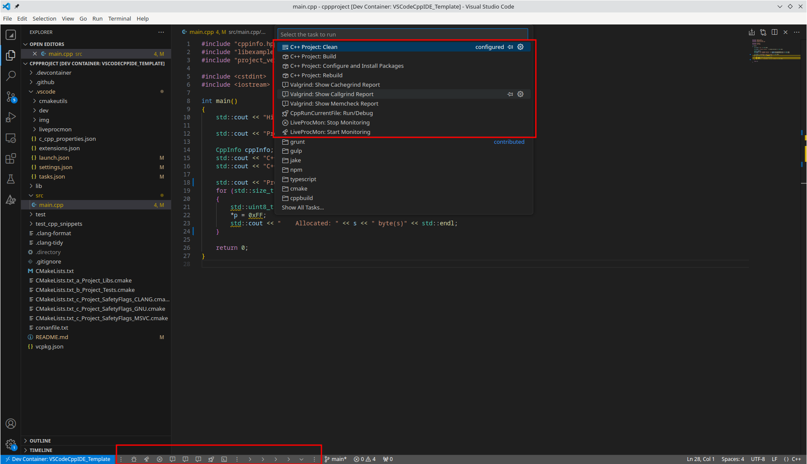
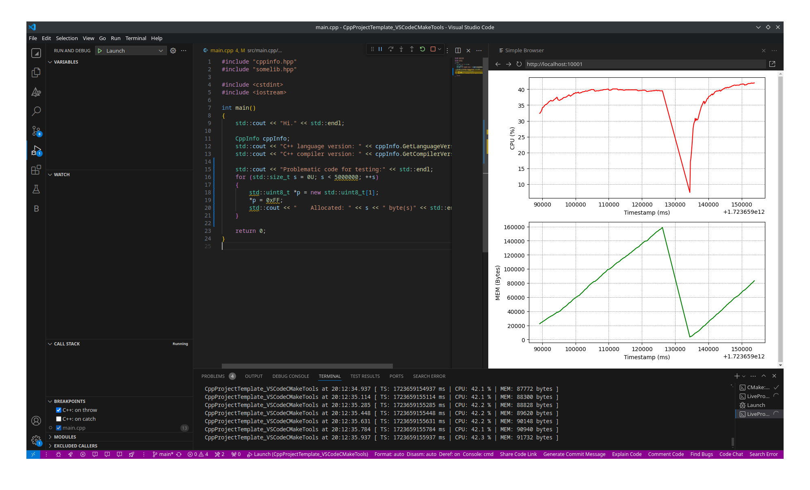

### CppProjectTemplate_VSCodeCMakeTools
Universal template of C++ project, was made to rapid start the new C++ project, easy debug and profile it. 
Configured over [MS C/C++ Extension Pack](https://marketplace.visualstudio.com/items?itemName=ms-vscode.cpptools-extension-pack) extension.

---

### Main tasks
* `CMake: Clean` - run `cmake.clean` command + remove all Valgrind reports
* `CMake: Configure and Build` - configure and run `cmake.build` command
* `CMake: Configure and Rebuild` - configure and run `cmake.cleanRebuild` command
* `CMake: Configure with Conan Install` - install `conanfile.txt` and run `cmake.configure` command
* `CppRunCurrentFile: Run/Debu` - build, run & debug currently opened `.cpp` source file
* `LiveProcMon: Start Monitoring` - start real-time monitoring of the target process (by default taken from `cmake.launchTargetPath`)
* `LiveProcMon: Stop Monitoring` - stop monitoring
* `Valgrind: Show Memcheck Report` - show profiler's report (check for memory leaks)
* `Valgrind: Show Cachegrind Report` - show profiler's report (check for chache missings)
* `Valgrind: Show Callgrind Report` - show profiler's report (check for tree of calls and theirs performing times)

### Shortcuts (in status bar)
* `Debug`
* `LiveProcMon: Start Monitoring`
* `LiveProcMon: Stop Monitoring`
* `Valgrind: Show Memcheck Report`
* `Valgrind: Show Cachegrind Report`
* `Valgrind: Show Callgrind Report`
* `CppRunCurrentFile: Run/Debug`

### Features
* easy to run inside Docker with [already prepared configuration](./.devcontainer_disabled)
* uses `CMake` to manage the project, configured to use extension [ms-vscode.cmake-tools](https://marketplace.visualstudio.com/items?itemName=ms-vscode.cmake-tools)
* uses Conan, automatically downloads packages from `conanfile.txt` before building the project
* easy to make and show `Valgrind` reports
* `LiveProcMon` feature checks resources consumption of the launched application, easy to configure, strart and stop:
* easy access to cppreference (via hotkey `Ctrl+Shift+A`) to get description of specified data type, method, etc
* enabled auto linting (with `clang-tidy`)
* enabled auto formatting (with `clang-format`)
* automatically [applies](https://github.com/R3D9477/CppProjectTemplate_VSCodeCMakeTools/blob/main/CMakeLists.txt#L9) name of directory as name of a project/library
* automatically finds and adds needed sources from certain folders, and includes them into the project's tree (described in [Configure](https://github.com/R3D9477/CppProjectTemplate_VSCodeCMakeTools/tree/main?tab=readme-ov-file#2-configure) and [Internal functions and variables description](https://github.com/R3D9477/CppProjectTemplate_VSCodeCMakeTools/tree/main?tab=readme-ov-file#internal-functions-and-variables-description))
* automatically adds (if possible) `Boost`, `Qt5`/`Qt6` libraries
* applies set of compiler's flags for extra safety: [GCC](https://github.com/R3D9477/CppProjectTemplate_VSCodeCMakeTools/blob/main/CMakeLists.txt_c_Project_SafetyFlags_GNU.cmake), [Clang](https://github.com/R3D9477/CppProjectTemplate_VSCodeCMakeTools/blob/main/CMakeLists.txt_c_Project_SafetyFlags_CLANG.cmake) or [MSVC](https://github.com/R3D9477/CppProjectTemplate_VSCodeCMakeTools/blob/main/CMakeLists.txt_c_Project_SafetyFlags_MSVC.cmake)
* automatically finds and adds unit tests *(**don't use** the dot symbol '`.`' in the name of test's source file!)*
* for MSVC automatically [copies](https://github.com/R3D9477/CppProjectTemplate_VSCodeCMakeTools/blob/main/CMakeLists.txt_z_Utils_VCRuntime.cmake) MS Visual C++ runtime libs to target building directory

### Basic project's stucture
ㅤㅤㅤㅤ**[ PROJECT_FOLDER = PROJECT_NAME ]**
 ㅤㅤㅤㅤㅤㅤㅤㅤ|
 ㅤㅤㅤㅤㅤㅤㅤㅤ|- *[CMakeLists.txt](CMakeLists.txt)*
 ㅤㅤㅤㅤㅤㅤㅤㅤ|- src
 ㅤㅤㅤㅤㅤㅤㅤㅤㅤㅤㅤㅤ|- **main.cpp**
 ㅤㅤㅤㅤㅤㅤㅤㅤ|- test
 ㅤㅤㅤㅤㅤㅤㅤㅤ|- lib
 ㅤㅤㅤㅤㅤㅤㅤㅤㅤㅤㅤㅤ|- **[ somelib ]**
 ㅤㅤㅤㅤㅤㅤㅤㅤㅤㅤㅤㅤㅤㅤㅤㅤ|
 ㅤㅤㅤㅤㅤㅤㅤㅤㅤㅤㅤㅤㅤㅤㅤㅤ|- *[CMakeLists.txt](lib/somelib/CMakeLists.txt)*
 ㅤㅤㅤㅤㅤㅤㅤㅤㅤㅤㅤㅤㅤㅤㅤㅤ|- include
 ㅤㅤㅤㅤㅤㅤㅤㅤㅤㅤㅤㅤㅤㅤㅤㅤ|- src
 ㅤㅤㅤㅤㅤㅤㅤㅤㅤㅤㅤㅤㅤㅤㅤㅤ|- test
 ㅤㅤㅤㅤㅤㅤㅤㅤㅤㅤㅤㅤㅤㅤㅤㅤ|- thirdparty
 ㅤㅤㅤㅤㅤㅤㅤㅤㅤㅤㅤㅤㅤㅤㅤㅤㅤㅤㅤㅤ|
 ㅤㅤㅤㅤㅤㅤㅤㅤㅤㅤㅤㅤㅤㅤㅤㅤㅤㅤㅤㅤ|- **[ thirdlib ]**
 ㅤㅤㅤㅤㅤㅤㅤㅤㅤㅤㅤㅤㅤㅤㅤㅤㅤㅤㅤㅤㅤㅤㅤㅤ|
 ㅤㅤㅤㅤㅤㅤㅤㅤㅤㅤㅤㅤㅤㅤㅤㅤㅤㅤㅤㅤㅤㅤㅤㅤ|- *[CMakeLists.txt](lib/somelib/thirdparty/thirdlib/CMakeLists.txt)*
 ㅤㅤㅤㅤㅤㅤㅤㅤㅤㅤㅤㅤㅤㅤㅤㅤㅤㅤㅤㅤㅤㅤㅤㅤ|- include
 ㅤㅤㅤㅤㅤㅤㅤㅤㅤㅤㅤㅤㅤㅤㅤㅤㅤㅤㅤㅤㅤㅤㅤㅤ|- src
 ㅤㅤㅤㅤㅤㅤㅤㅤㅤㅤㅤㅤㅤㅤㅤㅤㅤㅤㅤㅤㅤㅤㅤㅤ|- test

---

### HOW TO

#### 1. Install and Open

###### Variant #1: Inside Docker
  * 1.1.1. install docker on your host machine ([Install Docker Engine](https://docs.docker.com/engine/install/))
  * 1.1.2. install docker-compose on your host machine ([Overview of installing Docker Compose](https://docs.docker.com/compose/install/))
  * 1.1.3. rename directory `.devcontainer_disabled` to `.devcontainer` to enable config
  * 1.1.4. [Open an existing folder in a container](https://code.visualstudio.com/docs/devcontainers/containers#_quick-start-open-an-existing-folder-in-a-container)

###### Variant #2: On your host machine
  * 1.2.1. install gcc (e.g. `apt install gcc gdb`)
  * 1.2.2. install clang (e.g. `apt install clang clang-tidy clang-format lldb`)
  * 1.2.3. install python (e.g. `apt install python3 python3-venv`, do `python3 -m venv ~/.local --system-site-packages` and add `~/.local/bin` to global `PATH` variable)
  * 1.2.4. install cmake (e.g. `pip install cmake`)
  * 1.2.5. install conan (e.g. `pip install conan` and do `conan profile detect`)
  * 1.2.6. install ploting tools (e.g. `pip install gprof2dot matplotlib pillow`)

#### 2. Configure
  * 2.1. clone that repositoy to your local machine
  * 2.2. current source directory is `./src`. if needed, change main sources directory [HERE](https://github.com/R3D9477/CppProjectTemplate_VSCodeCMakeTools/blob/main/CMakeLists.txt#L16)
  * 2.3. add some external libraries in [CMakeLists.txt_a_Project_Libs.cmake](https://github.com/R3D9477/CppProjectTemplate_VSCodeCMakeTools/blob/main/CMakeLists.txt_a_Project_Libs.cmake)
  * 2.4. add source of uint tests to folder `test` or add/change you testing configuration in [CMakeLists.txt_b_Project_Tests.cmake](https://github.com/R3D9477/CppProjectTemplate_VSCodeCMakeTools/blob/main/CMakeLists.txt_b_Project_Tests.cmake)
  * 2.5. change required libraries in [conanfile.txt](https://github.com/R3D9477/CppProjectTemplate_VSCodeCMakeTools/blob/main/conanfile.txt), the package manager will handle it automatically during first build
  * 2.6. if needed, you can customize safety flags for your current compiler: [GCC](https://github.com/R3D9477/CppProjectTemplate_VSCodeCMakeTools/blob/main/CMakeLists.txt_c_Project_SafetyFlags_GNU.cmake.cmake#L1), [Clang](https://github.com/R3D9477/CppProjectTemplate_VSCodeCMakeTools/blob/main/CMakeLists.txt_c_Project_SafetyFlags_CLANG.cmake#L1) or [MSVC](https://github.com/R3D9477/CppProjectTemplate_VSCodeCMakeTools/blob/main/CMakeLists.txt_c_Project_SafetyFlags_MSVC.cmake#L1)
  * 2.7. if neeeded, add [HERE](https://github.com/R3D9477/CppProjectTemplate_VSCodeCMakeTools/blob/main/CMakeLists.txt#L11) specific sources and includes of your current project (example you can see [HERE](https://github.com/R3D9477/SimpleCustomQmlItemQt6Cmake/blob/master/CMakeLists.txt#L12))

#### 3. Use
  * 3.1. run task `Terminal`>`Run Task`>`CMake: Configure with Conan Install`
  * 3.2. press `F5` to build `Debug` version (variant selected by default in CMake Tools) and run debugging process (by default using LLDB, can be changed in `launch.json`)
  * 3.3. use additinal tasks for profiling:
    * `LiveProcMon: Start Monitoring` to check resources consumption at real-time
    * `Valgrind: Show Memcheck Report`, `Valgrind: Show Callgrind Report` and `Valgrind: Show Cachegrind Report` to get profiler's reports
    * `CppRunCurrentFile: Run/Debug` to compile and run currently snippet (e.g. single `.cpp` file located in folder [test_cpp_snippets](https://github.com/R3D9477/CppProjectTemplate_VSCodeCMakeTools/tree/main/test_cpp_snippets))

---

### Internal functions and variables description
* **function** `get_sources_from_dir( SOURCES_DEST_VAR INCLUDES_DEST_VAR TARGET_FOLDER_PATH )` - scans `TARGET_FOLDER_PATH` **(non-recursive globbing)** and adds C++ files by the [mask](https://github.com/R3D9477/CppProjectTemplate_VSCodeCMakeTools/blob/main/CMakeLists.txt#L17) into variables: `SOURCES_DEST_VAR` (list of source files) and `INCLUDES_DEST_VAR` (list of include paths). examples of usage you can find [HERE](https://github.com/R3D9477/CppProjectTemplate_VSCodeCMakeTools/blob/main/lib/somelib/CMakeLists.txt#L8) and [HERE](https://github.com/R3D9477/CppProjectTemplate_VSCodeCMakeTools/blob/main/lib/somelib/thirdparty/thirdlib/CMakeLists.txt#L8)
* **variable** `OUTPUT_NAME` - the name of the current target name (target executable file name). usually it the same as varibale `PROJECT_NAME`, but for Qt6 application it different: `app${PROJECT_NAME}`. example of usage you can find in [CMakeLists.txt_z_Utils_Qt.cmake](https://github.com/R3D9477/CppProjectTemplate_VSCodeCMakeTools/blob/main/CMakeLists.txt_z_Utils_Qt.cmake)
* **variable** `SAFETY_FLAGS` - contains the list of the compiler's flags ([GCC](https://github.com/R3D9477/CppProjectTemplate_VSCodeCMakeTools/blob/main/CMakeLists.txt_c_Project_SafetyFlags_GNU.cmake.cmake#L1), [Clang](https://github.com/R3D9477/CppProjectTemplate_VSCodeCMakeTools/blob/main/CMakeLists.txt_c_Project_SafetyFlags_CLANG.cmake#L1) or [MSVC](https://github.com/R3D9477/CppProjectTemplate_VSCodeCMakeTools/blob/main/CMakeLists.txt_c_Project_SafetyFlags_MSVC.cmake#L1))

---

### Used extensions
* required
  * [ms-vscode.cpptools-extension-pack](https://marketplace.visualstudio.com/items?itemName=ms-vscode.cpptools-extension-pack) - support of C++ intellisense, refactoring, sources colorization, etc.
  * [xaver.clang-format](https://marketplace.visualstudio.com/items?itemName=xaver.clang-format) - code formatter
  * [vadimcn.vscode-lldb](https://marketplace.visualstudio.com/items?itemName=vadimcn.vscode-lldb) - support of LLDB debugger
  * [tintinweb.graphviz-interactive-preview](https://marketplace.visualstudio.com/items?itemName=tintinweb.graphviz-interactive-preview) - visualize charts, required for Callgrind reports
  * [ryuta46.multi-command](https://marketplace.visualstudio.com/items?itemName=ryuta46.multi-command) - support of custom commands
  * [rioj7.command-variable](https://marketplace.visualstudio.com/items?itemName=rioj7.command-variable) - advanced variables substitution
  * [ArturoDent.launch-config](https://marketplace.visualstudio.com/items?itemName=ArturoDent.launch-config) - allows to launch debugging with specific configuration
* additional
  * [Gruntfuggly.activitusbar](https://marketplace.visualstudio.com/items?itemName=Gruntfuggly.activitusbar) - debugging and profiling shortcuts in status bar
  * [matepek.vscode-catch2-test-adapter](https://marketplace.visualstudio.com/items?itemName=matepek.vscode-catch2-test-adapter) - a better unit tests explorer for GTests (but has no support of Boost.UnitTest)
  * [Guyutongxue.cpp-reference](https://marketplace.visualstudio.com/items?itemName=Guyutongxue.cpp-reference) - easy access to cppreference
  * [krosf.vscode-valgrind](https://marketplace.visualstudio.com/items?itemName=krosf.vscode-valgrind) - colorization of Valgrind reports
  * [CFXS.BuildOutputColorizerIAR](https://marketplace.visualstudio.com/items?itemName=CFXS.BuildOutputColorizerIAR) - colorization of output
  * [SR-team.vscode-autohide-fork](https://marketplace.visualstudio.com/items?itemName=SR-team.vscode-autohide-fork) - autohide bottom panel with terminal
  * [jiapeiyao.tab-group](https://marketplace.visualstudio.com/items?itemName=jiapeiyao.tab-group) - grouped tabs
  * [Blackboxapp.blackbox](https://marketplace.visualstudio.com/items?itemName=Blackboxapp.blackbox) - AI helper
  * [liangruliu.customize-toolbar](https://marketplace.visualstudio.com/items?itemName=liangruliu.customize-toolbar) - code folding/unfolding buttons in editor's toolbar
  * [hediet.vscode-drawio](https://marketplace.visualstudio.com/items?itemName=hediet.vscode-drawio) - draw.io diagrams right in VSCode

### Tested on
* Linux (GCC,Clang)
* Windows (Clang,MinGW,MSVC)

### Notes:
* `Valgrind` reports feature currently available for Linux only
* `LiveProcMon` feature currently available for Linux only

### Links
* used in template of ["Qml Multilingual Application"](https://github.com/R3D9477/EmptyQmlMuiApp)
* used in demo ["Simple Custom Qml Item Qt6 Cmake"](https://github.com/R3D9477/SimpleCustomQmlItemQt6Cmake)
